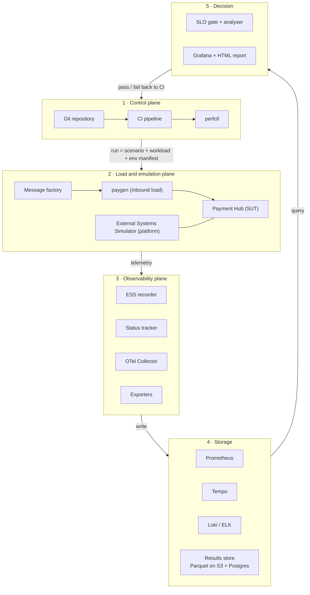
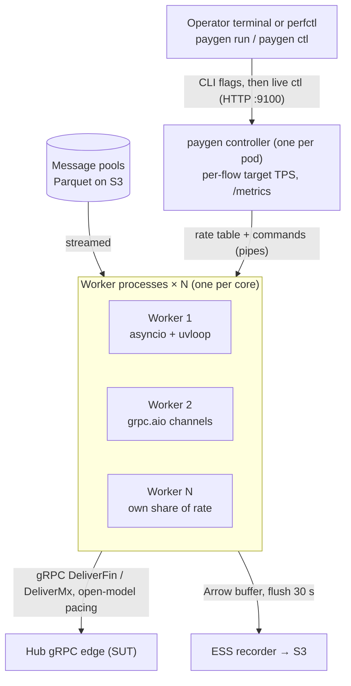
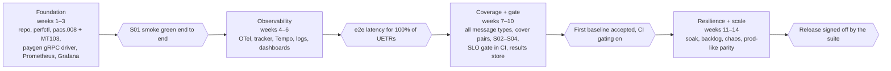

# Performance Testing Infrastructure — SWIFT Payments Platform

> Exported from the living design doc on 2026-09-28. Diagrams are Mermaid versions of the originals.

2026-09-28 · Jatin Mehta

## 1. Context and goals

The framework is a Python-first, git-versioned toolkit that drives realistic SWIFT payment load into a Kafka/gRPC microservices platform and proves, with end-to-end traces keyed on the UETR, whether each release meets its latency, throughput and resilience targets.

**System under test (SUT):** a payment hub that ingests, validates, enriches, screens, routes and settles cross-border payments. Services talk over gRPC (synchronous) and Kafka (asynchronous events).

**Message families in scope**

| Family | Messages | Business meaning | Perf relevance |
| --- | --- | --- | --- |
| ISO 20022 (MX) | pacs.008 | FI-to-FI customer credit transfer | Highest volume; drives the peak profile |
| ISO 20022 (MX) | pacs.009 (incl. COV / ADV) | FI-to-FI financial institution transfer | Lower volume, higher value; cover flows add a linked second message |
| ISO 20022 (MX) | pacs.002, pacs.004, camt.056 / camt.029 | Status, return, recall | Asynchronous responses; used to close the transaction loop |
| MT (legacy) | MT103 | Single customer credit transfer | Coexistence / translation load (MT↔MX) |
| MT (legacy) | MT202 / MT202 COV | FI transfer / cover | Pairs with MT103 for cover-method tests |

**Goals of the framework**

1. Measure end-to-end and per-hop latency (p50 / p95 / p99 / p99.9) per message type.
2. Find the sustainable throughput (TPS) and the breaking point of each service and of the whole flow.
3. Prove resilience: back-pressure, consumer-lag recovery, retries and exactly-once / idempotency under failure.
4. Gate every release in CI with automated pass/fail against agreed SLOs, and keep a trend history per build.
5. Stay reproducible: every test = code + data profile + environment manifest in git.

**Working non-functional targets (to confirm with the business)**

| Metric | Proposed target |
| --- | --- |
| Sustained throughput | 500 TPS steady, 1,500 TPS peak burst for 15 min |
| End-to-end latency pacs.008 (ingest → settled/status) | p95 < 1.5 s, p99 < 3 s |
| Per gRPC hop latency | p99 < 50 ms |
| Kafka consumer lag | < 5 s at steady state; drains within 2 min after a burst |
| Error / reject rate (technical) | < 0.01% |
| Soak | 8 h at 70% of peak with no memory growth or latency drift > 10% |

## 2. System under test

The Payment Hub (the Hub), its gRPC interfaces and its internal Kafka design are specified in the platform document: Payments Platform Design — Payment Hub (`docs/platform-design.md`). This document covers only how that platform is driven, observed and judged under load.

**What the framework relies on from the platform**

- **gRPC is the only boundary.** The External Systems Simulator (ESS) plays FIN, SnF and FCC by calling `DeliverFin`, `DeliverMx`, `NotifyAck` and `NotifyFccDecision` on the Hub, and by serving `SendMt`, `SendMx` and `Screen` (platform sections 3–4, simulator in section 8). The framework never writes to the Hub's Kafka.
- **One read-only tap:** the status tracker reads `hub.pay.status` with its own consumer group and a read-only ACL (platform section 7).
- **UETR on every call and record**, plus `flow`, `run-id` and `traceparent` in gRPC metadata.
- **Seven timestamps per payment** (platform section 5):

| Stamp | Event | Captured by |
| --- | --- | --- |
| T0 | Inbound message sent (`DeliverFin` / `DeliverMx`) | ESS recorder (intended send time) |
| T1 | Hub replies ACCEPTED (message durable in Kafka) | ESS recorder |
| T2 | Canonical payment written (parse + validate done) | Status tracker |
| T3 | Screening reply returned | ESS recorder (FCC side) |
| T4 | Outbound handed off (`SendMt` / `SendMx` received) | ESS recorder |
| T5 | ACK / NAK sent back (`NotifyAck`) | ESS recorder |
| T6 | Status COMPLETED / REJECTED | Status tracker |

**The ESS is a platform component.** The simulator, its control API (`EssControl`: behaviour profiles, test cases, counters) and its three modes are specified in platform section 8. This framework runs it in *performance mode* and adds paygen for high-rate inbound load (section 6).

### 2.1 Measuring MT and MX separately

MT and MX get their own TPS, latency and resource figures. The design separates them at the gRPC method, the Kafka topic and a `format` label on every metric. Dedicated MT-only, MX-only and mixed runs then show each format's ceiling and how they interfere.

**Where the two formats are kept apart**

| Layer | MT signal | MX signal | Shared, split by label |
| --- | --- | --- | --- |
| gRPC in | `HubInbound.DeliverFin` | `HubInbound.DeliverMx` | — |
| Kafka in | `hub.in.fin.raw`, `cg-fin-parser` lag | `hub.in.mx.raw`, `cg-mx-parser` lag | — |
| Parsing pods | FIN parser deployment | MX parser deployment | — (separate CPU and memory figures) |
| Pipeline | — | — | `hub.pay.*` topics carry a `format` header; spans and metrics carry `format` and `flow` |
| Kafka out / gRPC out | `hub.out.fin`, `FinGateway.SendMt` | `hub.out.mx`, `SnfGateway.SendMx` | — |
| ESS recorder | rows with `format=MT` | rows with `format=MX` | Joined on UETR |

A payment's format is the format it **arrived** in. An MT103 that leaves as pacs.008 counts as MT (flow `MT_TO_MX_103`), because its inbound parse cost is MT. A cover pair counts as one transaction.

**Latency split into stages, using the timestamps T0–T6 (section 2)**

| Interval | Stage | Differs between MT and MX? |
| --- | --- | --- |
| T1 − T0 | gRPC ingress + durable Kafka write | Slightly (payload size) |
| T2 − T1 | Parse, validate, map to canonical | **Yes — the main format-specific cost** |
| T3 − T2 | FCC screening round trip | Somewhat (MX has more structured party data) |
| T4 − T3 | Route, settle, dispatch | Should be equal; if not, investigate |
| T5 − T4 | Mock network ACK delay | Set by the ESS profile, excluded from Hub results |
| T6 − T5 | ACK matching and completion | Should be equal |
| **T4 − T0** | **Hub processing latency** | Headline figure per format |
| **T6 − T0** | **End-to-end latency** | Business view per format |

**Throughput per format**

- **Hub TPS (MT or MX)** = transactions of that format reaching T4 (handoff) per second in the steady window. This excludes the mock's ACK delay, so it measures the Hub alone.
- **Completed TPS (MT or MX)** = transactions of that format reaching COMPLETED per second. This is the business figure.
- **Message rate** per method and topic (`DeliverFin/s`, `DeliverMx/s`, `SendMt/s`, `SendMx/s`) is used for sizing. A cover pair is 2 messages but 1 transaction.
- **Sustained** means completed TPS ≥ 98% of offered, flat consumer lag (in-flight count not growing, by Little's law), latency SLO met, and the 5th percentile of per-second completions within 10% of the median.

**Test runs that separate the formats**

| Run | Load | What it tells you |
| --- | --- | --- |
| MT-only ramp | MT flows only, stepped until an SLO breaks | MT ceiling (TPS) and MT cost per 1k TPS |
| MX-only ramp | MX flows only, stepped until an SLO breaks | MX ceiling and MX cost per 1k TPS |
| Mixed at target ratio | Expected MT:MX split at peak | Whether both formats meet their own SLOs together |
| Interference | MX held steady at target; MT ramped (then the reverse) | Whether one format's load degrades the other, and where they contend (FCC, database, shared topics) |

**MT vs MX scorecard (one per run, filled by the analyser)**

| KPI | MT | MX | Source |
| --- | --- | --- | --- |
| Max sustainable TPS (Hub, at T4) |  |  | Ramp runs, ESS recorder |
| Completed TPS at target load |  |  | ESS recorder + `hub.pay.status` |
| Hub latency p50 / p95 / p99 (T4 − T0) |  |  | ESS recorder |
| End-to-end latency p95 / p99 (T6 − T0) |  |  | ESS recorder |
| Parse and validate p99 (T2 − T1) |  |  | OTel spans |
| Parser consumer lag, max (s) |  |  | kafka-exporter per group |
| Parser CPU-seconds per 1k transactions |  |  | cAdvisor, per deployment |
| Bytes per transaction on Kafka |  |  | Broker metrics per topic |
| Reject / NAK / duplicate rate |  |  | ESS recorder |

The cells are empty on purpose: the analyser fills one scorecard per run.

**Implementation**

- ESS recorder metrics: `ess_calls_total{method, format, flow, outcome}` and `ess_transactions_total{format, flow, stage="handoff"|"completed"}`.
- Live view in Grafana: `sum by (format) (rate(ess_transactions_total{stage="handoff"}[1m]))`, with one panel row for MT and one for MX.
- The gate uses the recorder's per-UETR Parquet rows over the exact steady window, not the live dashboards.
- The SLO file gets a block per format, for example `{kpi: hub_latency_ms, format: MX, p: 99, max: 800}` and `{kpi: hub_tps_ratio, format: MT, min: 0.98}`.
- For capacity planning when the mix shifts, the ramp results give a cost weight. For example (illustrative), if the MT ceiling is 900 TPS and the MX ceiling is 600 TPS, one MX costs 1.5 MT-equivalents. Use this only for planning; the gate always judges MT and MX separately.

## 3. Performance framework architecture

The framework is split into five planes so each can be swapped independently: git defines a run, Python drives it, OpenTelemetry and Prometheus capture it, and an automated gate decides pass or fail.



The right-hand arrow is the feedback loop: the SLO gate returns a pass/fail exit code and a trend record to CI, so a regression blocks the release pipeline.

**Design principles**

- **Everything as code:** scenarios, workload mixes, SLO thresholds, dashboards (Grafana JSON) and environment manifests live in git and are reviewed like application code.
- **Measure completion, not submission:** latency is stamped at injection and at the final status event, matched on UETR — never inferred from producer acks.
- **Open, coordinated-omission-safe load:** arrival-rate (open model) generators, with latency recorded in HdrHistogram.
- **One correlation key everywhere:** UETR + run ID on every message, span, log line and metric label (run ID only on metrics, to keep cardinality low).
- **Generators are observed too:** load-generator CPU, send-queue depth and drift are captured, so a saturated generator can't masquerade as a slow SUT.

### 3.1 Component by component

The framework has 14 components. Five are written in-house in Python (perfctl, message factory, paygen, status tracker, analyser); the External Systems Simulator is a platform component (platform section 8); the rest are off-the-shelf tools that are configured, not coded.

| Plane | Component | What it does | Takes in | Produces | Built with | Build or configure |
| --- | --- | --- | --- | --- | --- | --- |
| Control | Git repository | Single source of truth for everything that defines a run | Pull requests | Versioned scenarios, workloads, SLOs, dashboards, env manifests | Git (GitLab / GitHub / Bitbucket) | Configure |
| Control | CI pipeline | Triggers runs (merge, nightly, release) and blocks on the gate | Git events, schedules | Pipeline status, archived reports | Jenkins or GitLab CI | Configure |
| Control | `perfctl` | One command that runs the whole lifecycle in 3.3 | Scenario name, environment | Run ID, run manifest, exit code | Python (Typer, Pydantic), bash wrappers, kubectl / Helm | **Build** |
| Load | Message factory | Pre-builds valid MT and MX messages into data pools before the run | Workload profile, seed, reference-data pool | Parquet pools of ready messages (UETR, flow, bytes) | Python (lxml, xmlschema, Faker, schwifty) | **Build** |
| Load | paygen — inbound load driver | Delivers inbound traffic at the target rate by calling `DeliverFin` / `DeliverMx` | Message pools, load shape | gRPC calls to the Hub, T0 / T1 stamps | Python paygen (asyncio, grpc.aio, uvloop) | **Build** |
| Load | External Systems Simulator (platform) | Plays FIN, SnF and FCC: answers `SendMt`, `SendMx`, `Screen`, and calls back with `NotifyAck` / `NotifyFccDecision` | Calls from the Hub, behaviour profile | Replies, callbacks, T3 / T4 / T5 stamps | Python `grpc.aio` server | Provided by the platform; run in performance mode |
| SUT | Payment Hub | The system being tested | Inbound gRPC | Outbound gRPC, status events | Your stack | — |
| Capture | ESS recorder | Writes one row per gRPC call the ESS makes or receives | Driver and responder events | Per-UETR Parquet rows, Prometheus counters | Python (pyarrow, prometheus-client), part of the ESS | **Build** |
| Capture | Status tracker | Reads the Hub's status topic to get T2 and T6 for every UETR | `hub.pay.status` (read-only consumer group) | Per-UETR Parquet rows | Python, confluent-kafka | **Build** (small) |
| Capture | OpenTelemetry Collector | Receives traces, metrics and logs; samples and routes them | OTLP from Hub, ESS, paygen | Data in Tempo, Prometheus, Loki | OTel Collector | Configure |
| Capture | Exporters | Expose infrastructure metrics | Kafka, JVM, nodes, containers, database | Prometheus metrics | kafka-exporter, JMX exporter, node-exporter, cAdvisor, postgres-exporter | Configure |
| Store | Metrics, traces, logs | Keep telemetry for the run and for trend comparison | Collector and exporter output | Queryable history | Prometheus, Tempo, Loki | Configure |
| Store | Results store | Keeps the authoritative per-UETR results and the run index | Recorder + tracker Parquet, run manifest | Run history for baselines and trends | S3-compatible object storage + PostgreSQL | Configure |
| Decide | Analyser and SLO gate | Joins recorder and tracker rows on UETR, computes the MT and MX scorecards, compares with SLOs and baseline | Parquet rows, SLO file, baseline | Pass / fail / invalid, JUnit XML, HTML report | Python (pandas or Polars, hdrhistogram, SciPy, Jinja2) | **Build** |
| Decide | Dashboards | Live view during the run; drill-down afterwards | Prometheus, Tempo, Loki | Dashboards, run annotations | Grafana (dashboards as JSON in git) | Configure |

**Why the ESS recorder and the status tracker are both needed:** the ESS sees everything that crosses the gRPC boundary (T0, T1, T3, T4, T5) but nothing inside the Hub. The tracker sees the Hub's own status events (T2, T6). Joining the two on UETR gives the full T0–T6 timeline (section 2) without the framework ever writing into the Hub's Kafka.

### 3.2 How the framework uses the External Systems Simulator

The External Systems Simulator (ESS) is built and owned by the platform (platform section 8). For performance runs it is used in *performance mode*, alongside **paygen**, the framework's own inbound load driver. The table shows how each piece is used here. Driver and responder scale separately: paygen scales with offered TPS, the ESS responder with the Hub's outbound call rate.

| Part | Runs as | Key design choices |
| --- | --- | --- |
| Inbound driver | paygen pods: one controller + one worker process per core (section 6) | Per-flow runners call `DeliverFin` / `DeliverMx` at the intended send time (open model). Rates are set from the CLI and can be changed live with `paygen ctl`. Messages stream from the pre-built Parquet pools, so no XML is built during the run. |
| Responder | `grpc.aio` async server, 2+ replicas behind a Kubernetes Service | Serves `FinGateway`, `SnfGateway`, `FccScreening`, `EssControl`. Replies after a delay drawn from the behaviour profile. Schedules `NotifyAck` and `NotifyFccDecision` callbacks on an async timer queue. |
| Behaviour profile | YAML in the scenario folder, applied through `EssControl.SetProfile` | Per network: accept latency, ACK delay distribution, NAK rate. For FCC: screen latency, hit rate, block rate, decision delay. Can be changed mid-run for fault scenarios, e.g. "FCC slow for 5 minutes". |
| Recorder | Library inside both parts | Appends one row per call (UETR, flow, format, method, direction, timestamp in ns, outcome) to an in-memory Arrow buffer. It flushes Parquet files to object storage every 30 s, and exposes Prometheus counters for live dashboards. No network hop per message, so recording doesn't slow the ESS. |
| Idempotency cache | In-process LRU per responder replica | De-duplicates repeated `SendMt` / `SendMx` / `Screen` calls on (UETR, message type), and counts them as duplicates. |

**Keeping the ESS from becoming the bottleneck**

- Size it for 2× the planned peak and run it on its own node pool (3.4).
- Every run checks ESS health: achieved vs target rate, send drift, CPU, and event-loop lag. If any is over its limit the run is marked invalid, not failed.
- Before first use, the ESS is benchmarked against a trivial "echo" Hub stub to prove its own ceiling.

### 3.3 What happens during one test run

A run is one command, `perfctl run --scenario S02_bau --env perf1`, which walks through ten steps. Every step writes to the run manifest, so a failed run shows exactly where it stopped.

| Step | What perfctl does | Tools touched | Output |
| --- | --- | --- | --- |
| 1. Resolve | Load scenario, workload, SLO file and environment manifest from git; create a run ID; record the git SHA and seed | Git, Pydantic | `run.json` manifest |
| 2. Pre-flight | Check Hub version, Kafka partitions and replicas, pod limits, and NTP clock skew (< 1 ms) against the manifest. Stop if they don't match. | kubectl, Kafka admin API, chrony | Parity report |
| 3. Prepare data | Build or reuse message pools for this seed and mix | Message factory | Parquet pools on S3 |
| 4. Deploy framework | `helm upgrade` the ESS driver, ESS responder and status tracker with the run ID | Helm, Kubernetes | Running pods |
| 5. Configure mock | Push FIN, SnF and FCC behaviour profiles | `EssControl.SetProfile` | Profiles applied |
| 6. Mark start | Write a run annotation, and tag the warm-up window | Grafana API | Annotation, window markers |
| 7. Drive load | Start paygen with the flows and load shape; watch generator health; apply mid-run faults if the scenario has any | paygen, EssControl, Chaos Mesh | Load applied, live dashboards |
| 8. Drain and collect | Stop load, wait until every UETR reaches a terminal state or times out; flush recorder and tracker; snapshot key Prometheus queries | ESS recorder, tracker, Prometheus API | Parquet results on S3 |
| 9. Analyse and gate | Join on UETR, compute the MT and MX scorecards, check SLOs and the baseline | Analyser | `verdict.json`, JUnit XML, HTML report |
| 10. Publish and tidy | Store the run index in PostgreSQL, archive the report in CI, scale framework pods to zero | PostgreSQL, CI, Helm | Trend history updated |

The exit code is 0 for pass, 1 for fail, and 2 for invalid (generator saturated, clock skew, or missing data). CI treats 2 as "re-run", not as a regression.

### 3.4 Deployment view

The framework runs on Kubernetes next to the Hub, but on its own node pool, so load generation never competes with the system it measures.

| Namespace | Runs | Node pool | Notes |
| --- | --- | --- | --- |
| `perf-control` | CI runners or agents, perfctl job | Shared tools pool | Short-lived jobs only |
| `perf-load` | ESS driver (paygen pods), ESS responder, status tracker | **Dedicated perf-load pool** | Never co-located with Hub pods; sized at 2× planned peak |
| `hub` | Payment Hub services, Kafka (e.g. Strimzi), PostgreSQL | Production-like pools | Mirrors the production topology, as checked in pre-flight |
| `observability` | OTel Collector, Prometheus, Tempo, Loki, Grafana, exporters | Dedicated pool | Kept up between runs so trends accumulate |
| Outside the cluster | Object storage (S3 or compatible), PostgreSQL for the run index, Git server | Managed services | Survive environment rebuilds |

**Network and security**

- mTLS on all gRPC between the ESS and the Hub, with certificates issued by cert-manager.
- Network policies allow `perf-load` to reach only the Hub's gRPC edge and the Kafka status topic (read-only ACL).
- Secrets come from Vault or Kubernetes secrets.
- The framework holds synthetic data only (see section 11).

### 3.5 Data each run produces

Each run leaves a self-contained evidence pack, keyed by run ID. It holds the raw per-UETR rows (the truth), the telemetry (the explanation) and the verdict (the decision).

| Data | Produced by | Stored in | Kept for | Used for |
| --- | --- | --- | --- | --- |
| Run manifest (git SHA, seed, env, versions) | perfctl | S3 + PostgreSQL run index | Permanently | Reproducing any run |
| Per-call rows (T0, T1, T3, T4, T5) | ESS recorder | Parquet on S3 | 90 days raw; aggregates permanently | Latency, TPS, duplicates |
| Per-UETR status rows (T2, T6) | Status tracker | Parquet on S3 | 90 days raw | End-to-end latency, lost payments |
| Metrics (CPU, lag, gRPC histograms) | Exporters, OTel | Prometheus | 30 days; downsampled longer if needed | Saturation and bottleneck analysis |
| Traces | OTel SDKs → Collector | Tempo | 7–14 days | Explaining slow payments |
| Logs | Hub and ESS via Collector | Loki | 7–14 days | Errors, rejects |
| Scorecards and verdict | Analyser | PostgreSQL + HTML in CI artefacts | Permanently | Trends, release sign-off |

## 4. Technology stack

The recommended stack is open-source, Python-centred and container-native; every choice has a like-for-like alternative if the bank already standardises on it.

| Layer | Component | Recommended tool | Why | Alternatives |
| --- | --- | --- | --- | --- |
| Language / runtime | Framework core | Python 3.12, Poetry or uv for deps | Team skill set; rich Kafka, gRPC and data libraries | — |
| Language / runtime | Glue and ops scripts | Bash (set -euo pipefail), Make | Environment bootstrap, CI steps, kubectl/helm wrappers | Taskfile, Just |
| Control | Orchestrator CLI | `perfctl` built on Typer + Pydantic settings | One entry point: `perfctl run --scenario peak_pacs008 --env perf1` | Invoke, Click |
| Control | Source control | Git (GitLab / GitHub / Bitbucket), trunk-based | Versioned scenarios, SLOs, dashboards; PR review | — |
| Control | CI/CD | GitLab CI or Jenkins pipelines | Nightly, per-release and on-demand runs; artefact retention | GitHub Actions, Tekton, Argo Workflows |
| Test data | ISO 20022 builder | `xmlschema` + `lxml` against SWIFT/CBPR+ XSDs, Jinja2 templates | Schema-valid pacs.008 / pacs.009 / pacs.002 at speed | `pyiso20022`, generated dataclasses (xsdata) |
| Test data | MT builder / parser | In-house MT writer + validation via `pycountry`, `schwifty` (IBAN/BIC) | Block 1–5 construction, field 121 UETR in block 3 | Prowide (Java) via a sidecar, if already licensed |
| Test data | Synthetic reference data | Faker + seeded generators, Parquet data pools | Deterministic, PII-free BICs, IBANs, names, amounts | SDV for distribution-faithful data |
| Load | Load engine | paygen: in-house Python generator (asyncio, grpc.aio, uvloop, Typer CLI), see section 6 | Per-flow rates set from the CLI and changed live, open-model pacing, per-UETR recording | Locust, k6, Gatling, JMeter |
| Load | Kafka client | `confluent-kafka` (librdkafka) | Highest-throughput Python producer; idempotent, transactional | aiokafka |
| Load | gRPC client | `grpcio` + `grpcio-tools` stubs from the SUT's .proto files | Native streaming and unary; metadata for UETR / traceparent | `ghz` for single-endpoint micro-benchmarks |
| Load | Latency recording | `hdrhistogram` (Python) | Accurate percentiles, mergeable across workers, coordinated-omission correction | — |
| Observability | Instrumentation | OpenTelemetry SDKs (auto + manual) in SUT and generators | Vendor-neutral traces, metrics, logs; W3C trace context | Vendor agents (Dynatrace, Datadog) |
| Observability | Telemetry pipeline | OpenTelemetry Collector | Tail sampling, attribute enrichment (run\_id), fan-out | Fluent Bit (logs only) |
| Observability | Metrics | Prometheus + kafka-exporter / Burrow, JMX exporter, node-exporter, cAdvisor | Pull-based, PromQL for SLO queries | VictoriaMetrics, Mimir, Thanos for long retention |
| Observability | Traces | Grafana Tempo | Cheap object storage, TraceQL, links from metrics exemplars | Jaeger, Zipkin |
| Observability | Logs | Grafana Loki (JSON logs with uetr, trace\_id) | Label-light, trace-to-log jumps in Grafana | ELK / OpenSearch |
| Observability | Dashboards and alerts | Grafana (dashboards as JSON in git, provisioned) | Single pane for metrics, traces, logs; annotations per run | Kibana |
| Analysis | Results store | Parquet on S3-compatible object storage for raw samples, PostgreSQL for run index and trends | Cheap raw retention; SQL for trend queries | TimescaleDB, InfluxDB |
| Analysis | Analyser and gate | pandas / Polars, SciPy (Mann–Whitney for regressions), Jinja2 HTML reports | Statistical comparison against baseline, not just thresholds | Custom thresholds only |
| Infrastructure | Runtime | Kubernetes + Helm for SUT and generators, Terraform for cloud resources | Repeatable environments, horizontal generator scaling | Docker Compose for a laptop-scale smoke rig |
| Infrastructure | Kafka | Apache Kafka (Strimzi on K8s) or Confluent Platform + Schema Registry | Mirrors production topology; partition/replica parity | Redpanda for local dev |
| Resilience | Fault injection | Chaos Mesh or Toxiproxy | Broker loss, network latency, pod kill during load | LitmusChaos |
| Quality | Framework tests | pytest, ruff, mypy, pre-commit | The framework itself is production-grade code | — |

### 4.1 Licensing: what is free and what costs money

The whole recommended stack can be built and run with **no licence fees**. Every core component is open source or free to use internally. You pay only for infrastructure, optional enterprise support, or optional commercial add-ons. Some components use copyleft (AGPL) or source-available licences, which a bank's open-source policy may need to approve. Licences checked 28 September 2026; this is not legal advice, so confirm with your legal or OSS-governance team.

| Component | Licence | Licence fee | What to watch |
| --- | --- | --- | --- |
| Python, bash, Git | PSF / GPLv3 / GPLv2 | Free | Tooling only; nothing is distributed |
| Locust ([repo](https://github.com/locustio/locust)) | MIT | Free | — |
| grpcio, Protobuf, confluent-kafka (librdkafka) | Apache 2.0 / BSD | Free | — |
| Python libraries: Typer, Pydantic, Faker, uvloop (MIT / Apache 2.0), xmlschema, schwifty, Polars, pytest, ruff (MIT); lxml, Jinja2, pandas, SciPy (BSD); pyarrow (Apache 2.0); hdrhistogram (permissive) | Permissive | Free | pycountry is LGPL-2.1: fine as an unmodified dependency |
| Apache Kafka, Strimzi, Kafka clients ([Confluent licence page](https://docs.confluent.io/platform/current/installation/license.html)) | Apache 2.0 | Free | — |
| Confluent Schema Registry | Confluent Community License (source-available) | Free | RBAC, schema linking and broker-side validation need an enterprise licence. Apicurio Registry (Apache 2.0) is an open-source alternative. |
| Confluent Control Center, Confluent Server features, Replicator | Commercial | **Paid** | Not needed by this design |
| Kubernetes, Helm, cert-manager, Chaos Mesh | Apache 2.0 | Free | — |
| Terraform ([HashiCorp FAQ](https://www.hashicorp.com/en/license-faq)) | Business Source License 1.1 | Free for internal use | You can't offer it as a competing product. OpenTofu (MPL 2.0) is a drop-in open-source alternative. |
| OpenTelemetry SDKs and Collector, Prometheus and exporters, Jaeger | Apache 2.0 | Free | — |
| Grafana, Loki, Tempo ([Grafana licensing](https://grafana.com/licensing/)) | AGPLv3 | Free | Internal use of unmodified builds creates no obligation. If you modify them and let others use them over a network, you must share the changes. Many banks require an OSS-policy sign-off for AGPL. Grafana Enterprise / Cloud are paid options. |
| k6 ([repo](https://github.com/grafana/k6)), if chosen instead of paygen | AGPLv3 | Free | Same AGPL note |
| JMeter; Gatling (community edition) | Apache 2.0 | Free | Gatling Enterprise is paid |
| OpenSearch | Apache 2.0 | Free | — |
| Elasticsearch / Kibana ([Elastic FAQ](https://www.elastic.co/pricing/faq/licensing)) | ELv2, SSPL or AGPLv3 | Free tier | Advanced features are paid subscriptions |
| PostgreSQL | PostgreSQL License | Free | — |
| Redis 8+ ([Redis licences](https://redis.io/legal/licenses/)) | RSALv2, SSPLv1 or AGPLv3 | Free | Valkey (BSD-3) is a fully open-source alternative |
| Object storage | Cloud S3: pay per use. MinIO: AGPLv3 | Cloud: **paid (usage)** | MinIO's community edition has been source-only since 2025 and was reported in maintenance mode from late 2025 ([Wikipedia](https://en.wikipedia.org/wiki/MinIO), [analysis](https://alexandre-vazquez.com/minio-maintenance-mode-s3-open-source-alternatives/)). Prefer your cloud's S3, Ceph RGW or SeaweedFS (Apache 2.0). |
| Jenkins; GitLab Community Edition | MIT | Free | GitLab Premium / Ultimate tiers and GitHub Actions minutes for private repositories are paid |
| WireMock, ghz, Toxiproxy | Apache 2.0 / MIT | Free | — |
| ISO 20022 XSDs (pacs, camt) ([iso20022.org](https://www.iso20022.org/iso-20022-message-definitions)) | Published by ISO 20022 RA | Free download | CBPR+ usage-guideline schemas come from Swift MyStandards, which needs a Swift login |
| Prowide Core ([repo](https://github.com/prowide/prowide-core)), if a Java MT library is wanted | Apache 2.0 | Free | MX validation and MT↔MX translation are in Prowide's commercial products (**paid**) |
| IBM MQ, only if the ESS must emulate an MQ adapter | Commercial | **Paid** (server) | Not needed for the gRPC design |
| APM (Dynatrace, Datadog, AppDynamics) | Commercial | **Paid** | Optional; OTel can export to them if the bank already has one |

**AGPL-free option, if your policy rules AGPL out:** replace Tempo with Jaeger and Loki with OpenSearch; keep Prometheus or use VictoriaMetrics. Grafana has no like-for-like Apache-licensed replacement, so it usually gets a policy exception. The alternative is the dashboards built into OpenSearch / Jaeger, or the younger CNCF project Perses.

## 5. Workload modelling and test data

Workloads are declared as YAML profiles in git and turned into schema-valid, unique, PII-free messages by a Python message factory, so any run can be replayed exactly from its seed.

**Workload model inputs** — derived from production telemetry (anonymised volumes per message type per 5-minute bucket) or, pre-go-live, from business forecasts:

- **Message mix** per scenario (share of pacs.008, pacs.009, MT103, MT202, cover pairs, recalls).
- **Arrival shape:** intraday curve (market open, CLS window, cut-off spikes), bursts, and month-end peaks.
- **Payload variance:** currency mix, amount distribution (log-normal), remittance-info length, number of intermediary agents — these change parse and screening cost.
- **Negative traffic:** schema-invalid, duplicate UETR, sanctions hits, unknown BIC — typically 1–3% so reject paths are also exercised.

**Example workload profile (`workloads/peak_mixed.yaml`)**

```yaml
name: peak_mixed
seed: 20260928
duration: 45m
shape:
  type: stages            # open model: target arrival rate, not users
  stages:
    - {ramp_to_tps: 500,  over: 5m}
    - {hold_tps: 500,     for: 20m}
    - {ramp_to_tps: 1500, over: 2m}
    - {hold_tps: 1500,    for: 15m}
    - {ramp_to_tps: 0,    over: 3m}
mix:
  pacs.008:            0.55
  pacs.009:            0.10
  pacs.009_cov_pair:   0.05   # pacs.009 COV + linked pacs.008
  mt103:               0.18
  mt202:               0.07
  mt103_mt202cov_pair: 0.03
  camt.056_recall:     0.01
  invalid:             0.01
entry_points:
  grpc_ingress: 0.6
  swift_drop:   0.4
data_pool: pools/eu_uk_us_v3.parquet
```

**Message factory rules**

1. One UETR (UUID v4) per business transaction; cover pairs share it, as SWIFT gpi requires.
2. Every message is validated against the CBPR+ / SWIFT XSD (MX) or the MT field rules before it enters a data pool; invalid ones are only produced on purpose.
3. Messages are pre-generated into Parquet pools before the run so generation cost never limits injection rate; generators stream from the pool.
4. Each message carries `run_id` and `scenario` in a Kafka header / gRPC metadata (never in the business payload), plus a W3C `traceparent`.
5. No production data: BICs come from a synthetic directory mirroring real BIC structure; IBANs pass checksum via `schwifty`; names and addresses from seeded Faker.

## 6. Load generation: paygen, an in-house Python traffic generator

Load is generated by `paygen`, an in-house Python generator that replaces Locust. You pick the flows, rates and duration on the command line, and can change any flow's rate, or pause and resume it, while the run is live. It is the External Systems Simulator's inbound driver from 3.2: it calls `DeliverFin` / `DeliverMx` on the Hub.

**Why build it rather than use Locust**

| Need | Locust | paygen |
| --- | --- | --- |
| Control per flow (MT103, pacs.008, cover pairs…) from the CLI | Indirect, via user classes and weights | First-class: `--flow NAME=TPS` |
| Change a rate mid-run from a terminal | Web UI or custom code | `paygen ctl set-rate` |
| Open-model load (arrival rate independent of response time) | Needs custom pacing code | Built in; the scheduler is the core |
| Latency from intended send time (no coordinated omission) | Not by default | Built in |
| Per-call recording joined on UETR | Custom event hooks | Built in (recorder library) |
| Ready-made web UI and community | Yes | No; Grafana dashboards instead |

The trade-off: paygen is roughly 1,500–2,500 lines of Python to build and maintain, and has no ready-made UI. In return it measures exactly what this design needs.



**How it works**

- **Controller process (one per pod):** reads the run plan (CLI flags plus an optional workload YAML) and turns it into a per-flow rate table. It splits each rate evenly across its workers, serves the control API on port 9100, and exposes Prometheus metrics.
- **Worker processes (one per CPU core):** each runs an asyncio event loop with uvloop. Using separate processes gets around Python's GIL, so throughput scales with cores.
- **Scheduler:** for each flow, the worker computes the intended send time of every message (constant rate or Poisson arrivals) and launches the gRPC call as a task at that moment, without waiting for earlier replies. That is what makes the load open-model.
- **Latency** is measured from the *intended* send time, so if the generator or the Hub stalls, the delay shows up as latency instead of disappearing.
- **Messages** come from the pre-built Parquet pools (section 5), already serialised to Protobuf bytes, so no XML or MT is built during the run. Garbage-collector pauses are reduced with `gc.freeze()` after start-up.
- **Concurrency cap:** a per-worker limit on in-flight calls (e.g. 2,000) protects the generator if the Hub stops answering. When the cap is hit, the generator counts dropped sends instead of silently slowing down.
- **Health:** achieved vs target TPS, send drift (p99 of actual minus intended time), CPU and event-loop lag. If drift is over 5 ms for more than 10 s, the run is flagged generator-bound (invalid).

**Command-line interface**

```bash
# Start a run: flows and rates straight from the command line
paygen run \
  --target hub-edge.hub.svc:8443 --tls \
  --flow MT_FIN_103=200 --flow MX_SNF_PACS008=300 --flow MX_SNF_PACS009COV_PAIR=20 \
  --ramp 5m --duration 30m --arrival poisson \
  --pool s3://perf-pools/eu_uk_us_v3/ --run-id S02-2026-09-28-01

# Or from a workload file, overriding one flow
paygen run --workload workloads/peak_mixed.yaml --flow MT_FIN_103=400

# Stepped ramp to find a ceiling (MX only)
paygen run --flow MX_SNF_PACS008=100 --step +100/5m --until slo-breach

# Live control while a run is going (from any terminal, or by perfctl)
paygen ctl status                                  # per-flow target, achieved, p99, drift
paygen ctl set-rate MX_SNF_PACS008 600 --over 2m   # ramp one flow to 600 TPS
paygen ctl set-rate --format MT x1.5               # scale every MT flow by 1.5
paygen ctl pause MT_FIN_103_202COV                 # stop one flow, keep others running
paygen ctl resume MT_FIN_103_202COV
paygen ctl burst MX_SNF_PACS008 1500 --for 60s     # cut-off spike, then back
paygen ctl stop --drain 60s                        # stop sending, wait for replies

# Useful extras
paygen flows list                                  # flows available in the pool
paygen dry-run --flow MT_FIN_103=50 --duration 1m  # validate plan and pool, send nothing
```

- The control API is plain HTTP + JSON (`POST /flows/{name}/rate`, `GET /status`), so bash scripts, CI and `curl` can drive it too. `paygen ctl` is a thin Typer client over it.
- Every control command is written to the run manifest with a timestamp and appears as a Grafana annotation, so a later reader can see exactly when a rate changed.

**Scaling out**

- One pod with 8 cores is expected to sustain a few thousand gRPC calls per second with MX payloads. This is an estimate to confirm with the ESS benchmark in 3.2.
- For more, perfctl starts several pods and splits each flow's rate across them. `perfctl ctl …` sends the same command to every pod's control API through a headless Kubernetes Service.
- Rule of thumb: plan generator capacity at 2× the highest target TPS.

**Code skeleton (worker scheduling loop)**

```python
import asyncio, time, uvloop, grpc
from paygen.pool import FlowPool
from paygen.recorder import Recorder
from hub.v1 import hub_edge_pb2_grpc as edge


class FlowRunner:
    def __init__(self, flow, stub, pool, rec, max_inflight=2000):
        self.flow, self.stub, self.pool, self.rec = flow, stub, pool, rec
        self.rate = 0.0  # TPS for this worker; changed live by the controller
        self.paused = False
        self.sem = asyncio.Semaphore(max_inflight)

    async def run(self, stop: asyncio.Event):
        next_t = time.perf_counter()
        while not stop.is_set():
            if self.paused or self.rate <= 0:
                await asyncio.sleep(0.05)
                next_t = time.perf_counter()
                continue
            next_t += 1.0 / self.rate  # intended send time (constant rate)
            delay = next_t - time.perf_counter()
            if delay > 0:
                await asyncio.sleep(delay)
            if self.sem.locked():
                self.rec.dropped(self.flow)
                continue  # never slow down silently
            asyncio.create_task(self.send(next_t))

    async def send(self, intended):
        async with self.sem:
            msg = self.pool.next()  # pre-serialised request + UETR
            meta = (
                ("uetr", msg.uetr),
                ("flow", self.flow),
                ("run-id", RUN_ID),
                ("traceparent", msg.traceparent),
            )
            call = self.stub.DeliverMx if msg.is_mx else self.stub.DeliverFin
            try:
                reply = await call(msg.request, metadata=meta, timeout=0.2)
                self.rec.call(msg, intended, time.perf_counter(), reply.status)
            except grpc.aio.AioRpcError as e:
                self.rec.call(msg, intended, time.perf_counter(), e.code().name)


async def worker_main(plan, control_pipe):
    uvloop.install()
    channel = grpc.aio.secure_channel(
        plan.target, plan.creds, options=[("grpc.keepalive_time_ms", 10000)]
    )
    stub = edge.HubInboundStub(channel)
    runners = {f: FlowRunner(f, stub, FlowPool(plan.pool, f), Recorder(plan)) for f in plan.flows}
    stop = asyncio.Event()
    asyncio.create_task(apply_control(control_pipe, runners, stop))  # set-rate / pause / stop
    await asyncio.gather(*(r.run(stop) for r in runners.values()))
```

**What stays the same:** the message factory, recorder, status tracker, SLO gate and dashboards are unchanged. Locust, k6, Gatling and JMeter remain possible alternatives, but none is required.

## 7. Observability and end-to-end correlation

Every payment is followed by UETR from injection to final status: the completion tracker gives 100% accurate end-to-end latency, while OpenTelemetry traces explain where the time went.

**Correlation keys**

| Key | Where it travels | Used for |
| --- | --- | --- |
| `uetr` | MX `<UETR>`, MT block 3 field 121, Kafka message key + header, gRPC metadata, log field | Business-level join across every hop, retries and cover pairs |
| `traceparent` (W3C) | Kafka header, gRPC metadata | Distributed trace; Kafka consumers start a child span or a span link for batch consumption |
| `run_id`, `scenario` | Kafka header, OTel resource attribute, Prometheus external label via the collector | Slice every dashboard and query by test run |
| `sent_ns` | Kafka header / gRPC metadata | Start clock for end-to-end latency |

**Per-payment timestamps:** T0–T6 as defined in section 2. The ESS recorder captures T0, T1, T3, T4 and T5; the status tracker captures T2 and T6 from `hub.pay.status`. The analyser joins both on UETR, and also reports **lost** payments (no final status within a timeout, e.g. 60 s) and **duplicates**.

**Metrics collected (Prometheus)**

- **Service RED:** request rate, errors, duration histograms per gRPC method (`grpc_server_handling_seconds`) and per Kafka handler.
- **Kafka:** consumer-group lag in messages and seconds (kafka-exporter / Burrow), bytes and records in/out, produce and fetch request latency, under-replicated partitions, ISR shrinks, rebalance count.
- **Runtime and platform:** CPU throttling, memory, GC pauses (JVM) or event-loop lag, thread / connection pools, pod restarts (cAdvisor, kube-state-metrics).
- **Datastores:** connection-pool wait, query latency, lock waits, replication lag.
- **Generators:** achieved vs target TPS, send drift, CPU, local send-queue depth.

**Tracing and logs**

- OTel Collector tail sampling keeps 100% of error and slow traces (e.g. > p99 target) and 5–10% of the rest, so trace volume stays affordable at 1,500 TPS.
- Prometheus exemplars link a latency spike straight to a Tempo trace; Tempo links to Loki logs by `trace_id`.
- Logs are structured JSON with `uetr`, `trace_id`, `run_id`, `service`, `stage`, never full payloads.

**Standard Grafana dashboards (JSON in git)**

1. Run overview: offered vs achieved TPS, e2e p50/p95/p99 by message type, error and lost counts, SLO status.
2. Pipeline stage breakdown: latency per stage (T1→T6) and consumer lag per topic.
3. Service deep-dive: RED + saturation per microservice.
4. Kafka cluster health.
5. Generator health.

## 8. Test types and scenario catalogue

Ten standard scenarios cover capacity, stability and resilience; each is a folder in git with its workload profile, environment manifest and SLO file.

| ID | Test type | Scenario | Load shape | Key question |
| --- | --- | --- | --- | --- |
| S01 | Smoke / baseline | Mixed traffic, low rate | 50 TPS, 10 min | Does the pipeline work end to end and are all metrics flowing? |
| S02 | Load (steady state) | Business-as-usual mix | 500 TPS, 30 min | Are SLOs met at expected daily peak? |
| S03 | Peak / burst | Cut-off spike, pacs.008-heavy | 500 → 1,500 TPS in 2 min, hold 15 min | Does lag drain and latency recover after the spike? |
| S04 | Stress / breakpoint | Stepped ramp | +100 TPS every 5 min until SLO breach | What is the max sustainable TPS and which component saturates first? |
| S05 | Soak / endurance | BAU mix | 70% of peak, 8–24 h | Memory leaks, latency drift, log / disk growth, connection churn |
| S06 | Cover-method correlation | pacs.009 COV + pacs.008, MT103 + MT202 COV | 300 TPS pairs | Are linked messages matched and settled without extra latency? |
| S07 | Backlog recovery | Pause a consumer group 10 min, then resume | 500 TPS | How fast is a 300k-message backlog drained without breaching downstream limits? |
| S08 | Resilience / chaos | Kill a broker, a pod, add 100 ms network latency | 500 TPS | No loss, no duplicates, bounded latency during failover |
| S09 | Component isolation | Single service via Kafka bypass or `ghz` | Stepped | Per-service ceiling and scaling curve per replica / partition |
| S10 | Negative-path load | 10% invalid, sanctions hits, duplicate UETRs | 300 TPS | Reject paths and exception queues don't slow the happy path |

## 9. KPIs, SLOs and automated pass/fail gates

A run passes only if every hard SLO holds over the measurement window and no KPI regresses significantly against the last accepted baseline; the gate returns exit code 0 or 1 to CI.

**SLO file (`scenarios/S02_bau/slo.yaml`)**

```yaml
window: {exclude_warmup: 5m, exclude_rampdown: 3m}
hard:
  - {kpi: e2e_latency_ms,  msg: pacs.008, p: 95, max: 1500}
  - {kpi: e2e_latency_ms,  msg: pacs.008, p: 99, max: 3000}
  - {kpi: e2e_latency_ms,  msg: mt103,    p: 99, max: 3500}
  - {kpi: achieved_tps_ratio,              min: 0.98}   # achieved / offered
  - {kpi: lost_messages,                   max: 0}
  - {kpi: duplicate_settlements,           max: 0}
  - {kpi: technical_error_rate,            max: 0.0001}
  - {kpi: consumer_lag_seconds, stat: max, max: 5}
  - {kpi: generator_drift_ratio,           max: 0.05}   # else run is invalid
regression:
  baseline: last_accepted          # tag in results store
  test: mann_whitney_u
  alpha: 0.01
  max_increase_pct: {e2e_p95: 10, cpu_per_1k_tps: 15}
```

**How the gate decides**

1. **Validity first:** generator drift, clock skew or missing telemetry marks the run *invalid* (neither pass nor fail) so noisy runs never become baselines.
2. **Hard SLOs:** percentiles computed from merged HdrHistograms and the tracker's per-UETR rows, per message type.
3. **Regression check:** distribution comparison against the baseline, plus efficiency KPIs (CPU and memory per 1k TPS) so a release that meets latency by using twice the hardware is still caught.
4. **Output:** JUnit XML (so CI shows pass/fail per SLO), an HTML report, a Grafana annotation, and a row in the trend table keyed by git SHA and SUT version.

## 10. Repository structure, git workflow and CI/CD

One mono-repo holds the framework code, scenarios, dashboards and infrastructure; CI runs a smoke test on every SUT merge, a full load suite nightly, and soak / chaos before each release.

```
perf-framework/
├── perfctl/                 # Python package: CLI, orchestration, gate
│   ├── cli.py               # Typer entry point: run | gate | report | baseline
│   ├── factory/             # pacs.008/009/002, camt.056, MT103/202 builders
│   ├── paygen/              # traffic generator: controller, workers, scheduler, ctl API
│   ├── tracker/             # completion tracker (status-topic consumer)
│   ├── analysis/            # HdrHistogram merge, SLO eval, regression stats
│   └── report/              # Jinja2 HTML + JUnit XML
├── proto/                   # SUT .proto files (git submodule or buf registry)
├── schemas/                 # ISO 20022 XSDs (pacs, camt), MT field rules
├── workloads/               # YAML workload profiles
├── scenarios/S01..S10/      # scenario.yaml, slo.yaml, chaos.yaml
├── environments/            # env manifests: partitions, replicas, versions
├── observability/
│   ├── otel-collector/      # collector config, tail-sampling policy
│   ├── prometheus/          # scrape configs, recording rules
│   └── grafana/dashboards/  # dashboards as JSON
├── deploy/helm/             # paygen, tracker, observability charts (ESS chart from the platform repo)
├── infra/terraform/         # perf environment resources
├── scripts/                 # bash: bootstrap.sh, run_suite.sh, collect.sh
├── tests/                   # pytest for the framework itself
└── .gitlab-ci.yml / Jenkinsfile
```

**Git workflow**

- Trunk-based with short-lived branches and PR review; SLO changes need approval from a named owner (CODEOWNERS on `scenarios/**/slo.yaml`).
- Tags pin a framework version to each release test (`perf-v1.4.0`), so results are reproducible.
- Every result row stores framework SHA, SUT version, scenario, environment manifest hash and seed.

**CI pipeline stages**

1. `lint-test` — ruff, mypy, pytest on the framework; XSD validation of sample messages.
2. `build` — container images for generators and tracker.
3. `provision` — `helm upgrade` generators and tracker; check SUT version and environment manifest match.
4. `run` — `perfctl run --scenario $SCENARIO --env $ENV` (paygen, tracker, Grafana annotation).
5. `collect` — flush tracker, export paygen histograms, snapshot Prometheus queries to Parquet.
6. `gate` — `perfctl gate` → JUnit XML + exit code.
7. `report` — publish HTML report as a CI artefact and link it in the merge request / release ticket.

| Trigger | Scenarios | Duration | Blocks |
| --- | --- | --- | --- |
| Merge to SUT main | S01 smoke | \~15 min | Merge (optional) |
| Nightly | S02, S03, S06, S10 | \~2.5 h | Next-day triage |
| Release candidate | S02–S08 incl. soak and chaos | \~1–2 days | Release sign-off |
| On demand | Any, parameterised | — | — |

## 11. Environments, infrastructure and test-data security

Results are only meaningful on a production-like environment whose shape is declared in git and checked before every run.

| Environment | Purpose | Scale vs production | Notes |
| --- | --- | --- | --- |
| Local (Docker Compose, Redpanda) | Framework development, script debugging | Tiny | No performance conclusions drawn |
| PERF-1 (Kubernetes) | Nightly and component tests | \~50% | Same partition counts and replication factor as prod |
| PERF-PROD-LIKE | Release sign-off, soak, chaos | 100% | Same node types, Kafka broker count, DB class; isolated from other test traffic |

**Parity checks run by `perfctl` before each test**

- Kafka: broker count, topic partitions, replication factor, `min.insync.replicas`, retention.
- Services: image versions, replica counts, CPU/memory limits, HPA settings.
- Downstream stubs: latency profile of mocked external systems (sanctions engine, RTGS, SWIFT network) matches agreed values.

**Stubs and virtualisation** — external dependencies (SWIFT network, RTGS, third-party screening) are replaced with configurable Python gRPC/HTTP stubs (or WireMock) that return realistic pacs.002 / ACK / NAK responses with injected latency distributions.

**Test-data security**

- Synthetic data only; no production payments, names or accounts in any perf environment.
- Secrets (Kafka SASL, mTLS certs, MQ credentials) from Vault / Kubernetes secrets, never in git.
- Payloads never logged; results store holds UETR, type, timestamps and outcome only.

## 12. Delivery roadmap and open questions

Build in four phases so the team gets a working end-to-end measurement early and adds coverage, gating and resilience on top of it.



The highlighted gate is the turning point: from there, every nightly and release build is automatically judged against a baseline.

**Open questions to settle before phase 1**

- [ ] What are the agreed business SLOs and peak volumes? The targets in section 1 are placeholders.
- [ ] Which CI platform and Kafka distribution does the bank already standardise on (GitLab vs Jenkins; Confluent vs Strimzi)?
- [ ] Does the SUT's ingress for SWIFT traffic arrive via IBM MQ, file transfer or API, and is MT→MX translation inside the SUT or upstream?
- [ ] Can the SUT teams add OpenTelemetry instrumentation and propagate UETR / traceparent headers, or must the framework rely on Kafka timestamps only?
- [ ] Which external systems (sanctions engine, RTGS, SWIFT) need stubs, and what latency profiles should they emulate?
- [ ] Is an existing APM (Dynatrace, Datadog, AppDynamics) mandated, in which case OTel exports to it instead of Tempo/Loki?

**Shared with the platform document (answers affect both)**

- [ ] Is the business definition of a completed payment the outbound handoff, the network ACK, or the final pacs.002 status?
- [ ] Is the real FCC call synchronous on the payment path, or does the SUT publish for screening and wait for a result event?
- [ ] What is the expected MT vs MX volume split now that coexistence has ended, and how much MT traffic comes through Swift's contingency conversion or in-flow translation?
- [ ] In production, will inbound MT/MX reach the Payment Hub through a gRPC edge as designed in the platform document, or through an MQ / Alliance Access adapter that the ESS should also emulate?
