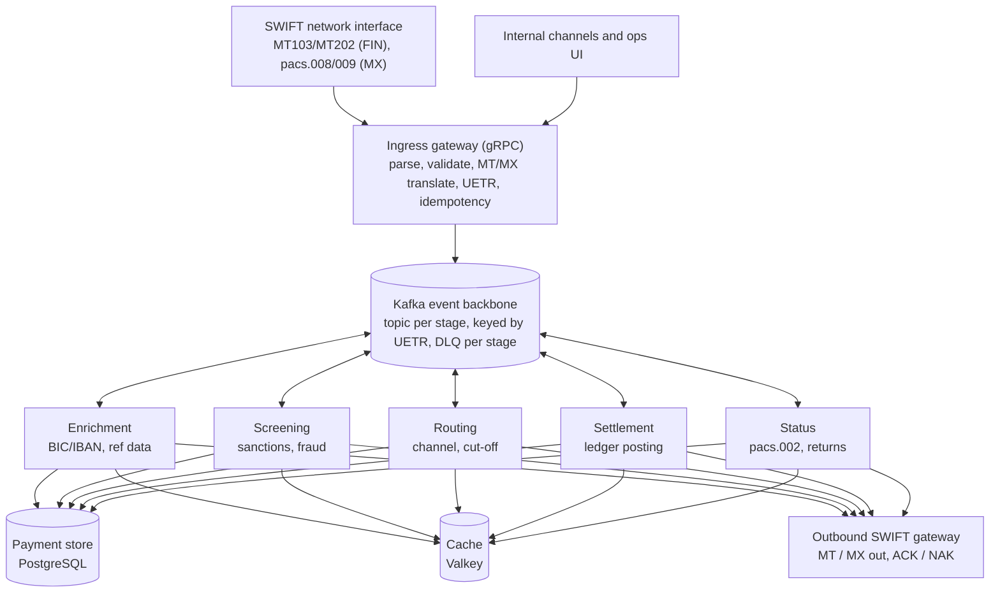
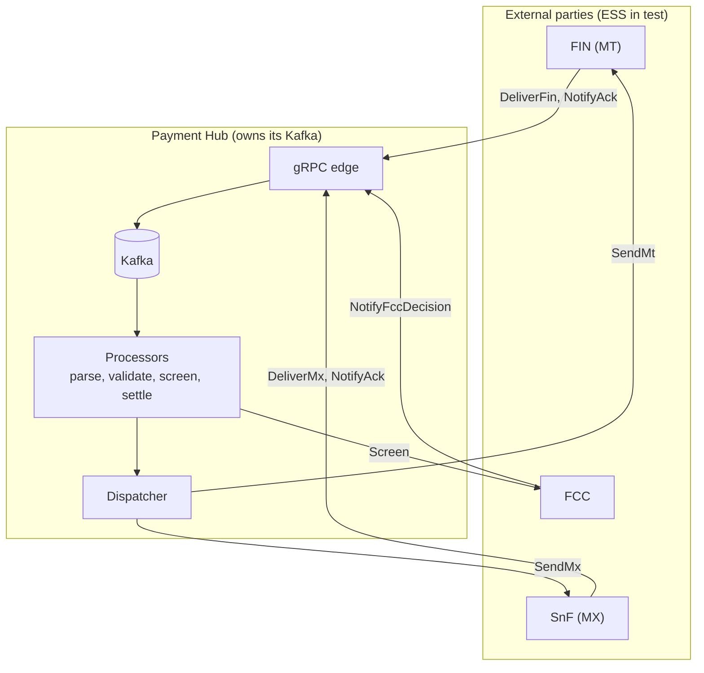
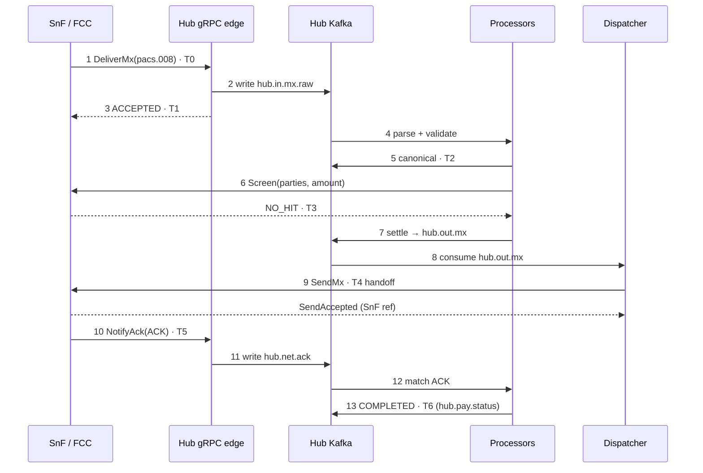
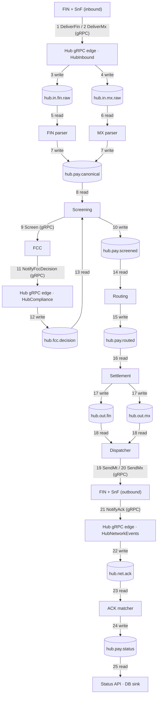
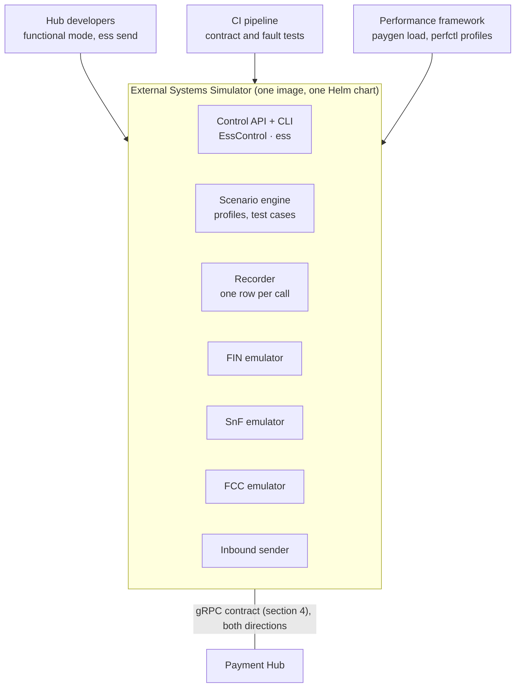

# Payments Platform Design — Payment Hub

> Exported from the living design doc on 2026-09-28. Diagrams are Mermaid versions of the originals.

2026-09-28 · Jatin Mehta

## 1. Context

The Payment Hub (the Hub) ingests, validates, screens, routes and settles cross-border payments arriving as SWIFT MT (FIN) or ISO 20022 MX (SWIFTNet Store-and-Forward). It talks to the outside world only over gRPC and uses Kafka internally as its processing backbone. How the platform is performance-tested is covered in the companion document, *Performance Testing Infrastructure*.

**Message families in scope**

| Family         | Messages                                | Business meaning                        | Notes                                      |
|----------------|-----------------------------------------|-----------------------------------------|--------------------------------------------|
| ISO 20022 (MX) | pacs.008                                | FI-to-FI customer credit transfer       | Highest volume                             |
| ISO 20022 (MX) | pacs.009 (incl. COV / ADV)              | FI-to-FI financial institution transfer | Cover flows add a linked second message    |
| ISO 20022 (MX) | pacs.002, pacs.004, camt.056 / camt.029 | Status, return, recall                  | Close the transaction loop                 |
| MT (legacy)    | MT103                                   | Single customer credit transfer         | Legacy counterparties, in-flow translation |
| MT (legacy)    | MT202 / MT202 COV                       | FI transfer / cover                     | Pairs with MT103 for cover-method payments |

**External parties**

| Party                            | Role                                                              | Interface to the Hub |
|----------------------------------|-------------------------------------------------------------------|----------------------|
| FIN (SWIFT network)              | Delivers and receives MT messages; returns ACK / NAK              | gRPC (section 3)     |
| SWIFTNet Store-and-Forward (SnF) | Delivers and receives MX messages; ACK and delivery notification  | gRPC                 |
| FCC (financial crime compliance) | Real-time sanctions / fraud screening; deferred decisions on hits | gRPC                 |

In test environments, all three are emulated by one mock, the **External Systems Simulator (ESS)**. The interfaces in this document are the same whether the Hub talks to the real systems or to the ESS, which is part of this platform and specified in section 8.

Swift ended MT/MX coexistence for cross-border payment instructions on 22 November 2025. Since then, MT103 / MT202 / MT202 COV sent on FIN go through Swift's charged contingency conversion to pacs.008 / pacs.009 ([BNY summary](https://www.bny.com/assets/corporate/documents/pdf/iso-20022-end-of-co-existence_-may-2025-final.pdf)). MT flows therefore mainly represent legacy counterparties, in-flow translation and internal MT sources.

## 2. Reference architecture

The Hub is a staged, event-driven pipeline: a gRPC edge, a Kafka topic per processing stage, and stateless microservices that consume, act and publish.



**Key properties**

- **Asynchronous completion:** a payment is "done" only when its final status event (COMPLETED / REJECTED) appears on the status topic, after the network acknowledgement.

- **UETR as the golden key:** every pacs.008 / pacs.009 / MT103 / MT202 carries a UETR (field 121 in MT block 3). It is the Kafka message key and travels as gRPC metadata, so every hop can be correlated.

- **Scaling units:** Kafka partitions per topic and consumer-group replicas per service. Partition count caps parallelism.

- **Format-neutral core:** MT and MX are parsed by separate services into one canonical payment model, and everything downstream is shared.

## 3. External boundary

The Hub talks to FIN, SnF and FCC **only through gRPC**. Kafka is internal: the Hub's gRPC edge writes what it receives into Kafka, and its processors read from and write to Kafka. No external party, and no test tool, ever writes into the Hub's Kafka.



**Who serves and who calls**

| gRPC service                                                   | Served by     | Called by               | Represents                                      | When it fires                       |
|----------------------------------------------------------------|---------------|-------------------------|-------------------------------------------------|-------------------------------------|
| `HubInbound` (`DeliverFin`, `DeliverMx`)                       | Hub gRPC edge | FIN / SnF               | The network delivering a message to the bank    | Every inbound payment               |
| `HubNetworkEvents` (`NotifyAck`, `NotifyDeliveryNotification`) | Hub gRPC edge | FIN / SnF               | Network ACK / NAK and SnF delivery notification | After each outbound send            |
| `HubCompliance` (`NotifyFccDecision`)                          | Hub gRPC edge | FCC                     | Analyst decision on a screening hit             | Only for hits, minutes later        |
| `FinGateway` (`SendMt`)                                        | FIN interface | Hub dispatcher          | The bank sending an MT over FIN                 | Every outbound MT                   |
| `SnfGateway` (`SendMx`)                                        | SnF interface | Hub dispatcher          | The bank sending an MX over SnF                 | Every outbound MX                   |
| `FccScreening` (`Screen`)                                      | FCC           | Hub screening processor | Real-time sanctions / fraud check               | Every payment, on the critical path |

**Transport rule:** anything that must be durable, or that arrives later, goes on Kafka inside the Hub. Anything that needs an immediate answer with a deadline is a gRPC call.

## 4. gRPC interface contract

The boundary has seven business RPCs, all unary: four served by the Hub and three by the external parties. MT and MX always use different methods, so every gRPC metric can be split by format without extra labels.

| \#  | RPC                               | Direction       | Request carries                                                               | Response means                                | Hub behaviour                                                                                                        |
|-----|-----------------------------------|-----------------|-------------------------------------------------------------------------------|-----------------------------------------------|----------------------------------------------------------------------------------------------------------------------|
| 1   | `HubInbound.DeliverFin`           | FIN → Hub       | UETR, raw MT (blocks 1–5), sender BIC, network timestamp                      | `ACCEPTED`: the Hub owns the message          | Light checks (size, duplicate UETR), write to `hub.in.fin.raw` with `acks=all`, then reply. No parsing on this path. |
| 2   | `HubInbound.DeliverMx`            | SnF → Hub       | UETR, head.001 AppHdr XML, pacs.008 / pacs.009 Document XML, SnF ref          | `ACCEPTED`                                    | Same as \#1, written to `hub.in.mx.raw`                                                                              |
| 3   | `HubNetworkEvents.NotifyAck`      | FIN / SnF → Hub | UETR, network (FIN / SNF), ACK or NAK, error code, send reference             | Received                                      | Write to `hub.net.ack`                                                                                               |
| 4   | `HubCompliance.NotifyFccDecision` | FCC → Hub       | UETR, case ID, RELEASE or BLOCK                                               | Received                                      | Write to `hub.fcc.decision`                                                                                          |
| 5   | `FccScreening.Screen`             | Hub → FCC       | UETR, parties (names, BICs, countries), amount, currency                      | `NO_HIT`, `HIT_PENDING` + case ID, or `BLOCK` | Screening processor waits for the reply (deadline, e.g. 1 s)                                                         |
| 6   | `FinGateway.SendMt`               | Hub → FIN       | UETR, raw outbound MT, receiver BIC                                           | `ACCEPTED` + session / ISN                    | Dispatcher records "sent" and waits for \#3 asynchronously                                                           |
| 7   | `SnfGateway.SendMx`               | Hub → SnF       | UETR, AppHdr + Document, requestor / responder DN, delivery-notification flag | `ACCEPTED` + SnF ref                          | As \#6                                                                                                               |

**Contract sketch** — two proto files, one per owner.

``` protobuf
// ===== hub/v1/hub_edge.proto  (served by the Payment Hub) =====
syntax = "proto3";
package hub.v1;

message MsgRef {
  string uetr     = 1;   // UUID v4; shared by cover pairs
  string msg_type = 2;   // "MT103", "MT202COV", "pacs.008.001.08"
  string flow     = 3;   // MT_FIN_103, MX_SNF_PACS008, ...
}

service HubInbound {
  rpc DeliverFin (FinDelivery) returns (DeliveryReceipt);
  rpc DeliverMx  (MxDelivery)  returns (DeliveryReceipt);
}
message FinDelivery {
  MsgRef ref           = 1;
  bytes  fin_message   = 2;   // blocks {1:}{2:}{3:{121:uetr}}{4:...}{5:}
  string sender_bic    = 3;
  int64  network_ts_ns = 4;
}
message MxDelivery {
  MsgRef ref           = 1;
  bytes  app_hdr       = 2;  // head.001
  bytes  document      = 3;  // pacs.008 / pacs.009
  string snf_ref       = 4;
  int64  network_ts_ns = 5;
}
message DeliveryReceipt {
  enum Status { STATUS_UNSPECIFIED = 0; ACCEPTED = 1; DUPLICATE = 2; REJECTED = 3; }
  Status status      = 1;
  int64  accepted_ns = 2;    // stamped after the Kafka write is acknowledged
}

service HubNetworkEvents {
  rpc NotifyAck (NetworkAck) returns (Received);
  rpc NotifyDeliveryNotification (DeliveryNotification) returns (Received);
}
message NetworkAck {
  MsgRef ref        = 1;
  string network    = 2;     // FIN | SNF
  bool   ack        = 3;     // false = NAK
  string error_code = 4;
  string send_ref   = 5;     // ISN or SnF ref from SendMt / SendMx
}

service HubCompliance {
  rpc NotifyFccDecision (FccDecision) returns (Received);
}
message FccDecision { MsgRef ref = 1; string case_id = 2; string decision = 3; }

// ===== ext/v1/networks.proto  (served by FIN / SnF interfaces and FCC) =====
service FinGateway   { rpc SendMt (SendMtRequest) returns (SendAccepted); }
service SnfGateway   { rpc SendMx (SendMxRequest) returns (SendAccepted); }
service FccScreening { rpc Screen (ScreenRequest) returns (ScreenResult); }
```

**Rules that apply to every call**

- **Metadata:** `uetr`, `flow`, `traceparent` (and `run-id` in test environments).

- **Deadlines:** the caller always sets one. Proposed: 200 ms for `Deliver*`, 500 ms for `Send*`, 1 s for `Screen`.

- **Retries:** `UNAVAILABLE` and `DEADLINE_EXCEEDED` are retried with exponential backoff and jitter, at most 3 times. `INVALID_ARGUMENT` is never retried.

- **Idempotency:** the receiver de-duplicates on (UETR, message type, direction). A repeat returns `DUPLICATE` or the original reply, never a second payment.

- **Connections:** long-lived HTTP/2 channels with mTLS, client-side round-robin across replicas, keep-alive on.

- **Durable before acknowledged:** the Hub replies `ACCEPTED` to `Deliver*` only after the Kafka write is acknowledged, so an accepted message survives a crash.

## 5. Payment flow step by step

A single pacs.008 makes four gRPC calls across the boundary (deliver, screen, send, ACK) and eight Kafka hops inside the Hub. Seven timestamps, T0–T6, are taken along the way; the performance document uses them to measure latency per stage.



**The same payment as MT103 — what changes at each step**

| Step | MX pacs.008 (above)                        | MT103                                                     | Why it matters                                               |
|------|--------------------------------------------|-----------------------------------------------------------|--------------------------------------------------------------|
| 1    | `DeliverMx` with AppHdr + Document XML     | `DeliverFin` with raw FIN blocks 1–5                      | Different method and payload size                            |
| 2    | `hub.in.mx.raw`                            | `hub.in.fin.raw`                                          | Separate topics, so separate lag and throughput              |
| 4    | XML parse + XSD + CBPR+ rule checks        | FIN tag parse + MT field rules, then MT→canonical mapping | The main format-specific cost                                |
| 5–8  | Canonical payment                          | Canonical payment                                         | Identical code from here                                     |
| 7    | `hub.out.mx`                               | `hub.out.fin`, or `hub.out.mx` if routed on as MX         | Outbound format is decided by routing, not by inbound format |
| 9    | `SendMx`                                   | `SendMt`                                                  | Separate methods                                             |
| 10   | SnF ACK (+ optional delivery notification) | FIN ACK / NAK                                             | Different network semantics                                  |

**Cover pairs** (pacs.009 COV + pacs.008, or MT103 + MT202 COV): both legs arrive through their own `Deliver*` calls with the same UETR, so Kafka places them on the same partition. The **screening** processor holds the first leg in its state store (state `AWAITING_COVER`) until the second arrives, then releases both together — the business rule is that both legs clear compliance before either is released. The ACK matcher matches the pair again on the way back, so T6 is stamped only when both legs have been acknowledged.

Because one UETR then carries two messages, each stage's idempotency marker is per leg (`screened:MT103`, `screened:MT202COV`) rather than per UETR; otherwise the first leg would mark the stage done and the second would be skipped.

**Screening hits:** at step 6 FCC returns `HIT_PENDING` and the payment is parked in state HELD. Minutes later FCC calls `NotifyFccDecision`; the Hub writes it to `hub.fcc.decision`, and processing resumes from step 7.

## 6. Touchpoint map: every gRPC and Kafka hop

One payment passes up to 25 touchpoints: 7 gRPC calls across the boundary and 18 Kafka reads and writes inside the Hub. MT and MX stay on separate lanes until the canonical topic (touchpoint 7), then split again at the outbound topics (17).



| \#  | Type        | From → to                                  | Call or topic                       | What happens                                    | Timestamp                      |
|-----|-------------|--------------------------------------------|-------------------------------------|-------------------------------------------------|--------------------------------|
| 1   | gRPC        | FIN → Hub edge                             | `HubInbound.DeliverFin`             | Inbound MT delivered                            | T0 (sent), T1 (ACCEPTED reply) |
| 2   | gRPC        | SnF → Hub edge                             | `HubInbound.DeliverMx`              | Inbound MX delivered                            | T0, T1                         |
| 3   | Kafka write | Hub edge → `hub.in.fin.raw`                | produce, `acks=all`                 | Raw MT stored durably before the edge replies; the edge then writes RECEIVED to `hub.pay.status` without waiting on it | —                              |
| 4   | Kafka write | Hub edge → `hub.in.mx.raw`                 | produce, `acks=all`                 | Raw MX stored durably                           | —                              |
| 5   | Kafka read  | `hub.in.fin.raw` → FIN parser              | `cg-fin-parser`                     | Parse MT, apply MT rules, map to canonical      | —                              |
| 6   | Kafka read  | `hub.in.mx.raw` → MX parser                | `cg-mx-parser`                      | Parse XML, XSD + CBPR+ checks, map to canonical | —                              |
| 7   | Kafka write | Parsers → `hub.pay.canonical`              | produce                             | Canonical payment with `format` header          | T2                             |
| 8   | Kafka read  | `hub.pay.canonical` → Screening            | `cg-screening`                      | Build screening request                         | —                              |
| 9   | gRPC        | Screening → FCC                            | `FccScreening.Screen`               | NO_HIT, HIT_PENDING or BLOCK                    | T3 (reply)                     |
| 10  | Kafka write | Screening → `hub.pay.screened`             | produce                             | Cleared payment moves on (hits go to HELD)      | —                              |
| 11  | gRPC        | FCC → Hub edge                             | `HubCompliance.NotifyFccDecision`   | Release or block for a held payment             | hit decided                    |
| 12  | Kafka write | Hub edge → `hub.fcc.decision`              | produce                             | Decision stored durably                         | —                              |
| 13  | Kafka read  | `hub.fcc.decision` → Screening             | `cg-screening`                      | Released payment resumes at 10                  | —                              |
| 14  | Kafka read  | `hub.pay.screened` → Routing               | `cg-routing`                        | Choose FIN or SnF and the outbound format       | —                              |
| 15  | Kafka write | Routing → `hub.pay.routed`                 | produce                             | Routed payment                                  | —                              |
| 16  | Kafka read  | `hub.pay.routed` → Settlement              | `cg-settlement`                     | Post to the ledger                              | —                              |
| 17  | Kafka write | Settlement → `hub.out.fin` or `hub.out.mx` | produce                             | Outbound message ready to send                  | —                              |
| 18  | Kafka read  | `hub.out.*` → Dispatcher                   | `cg-dispatch-fin`, `cg-dispatch-mx` | Take the next message to send                   | —                              |
| 19  | gRPC        | Dispatcher → FIN                           | `FinGateway.SendMt`                 | Outbound MT handed to FIN                       | T4 (handoff)                   |
| 20  | gRPC        | Dispatcher → SnF                           | `SnfGateway.SendMx`                 | Outbound MX handed to SnF                       | T4                             |
| 21  | gRPC        | FIN / SnF → Hub edge                       | `HubNetworkEvents.NotifyAck`        | Network ACK or NAK                              | T5                             |
| 22  | Kafka write | Hub edge → `hub.net.ack`                   | produce                             | ACK stored durably                              | —                              |
| 23  | Kafka read  | `hub.net.ack` → ACK matcher                | `cg-ack-matcher`                    | Match ACK to the sent payment by UETR           | —                              |
| 24  | Kafka write | ACK matcher → `hub.pay.status`             | produce                             | COMPLETED (or REJECTED on NAK)                  | T6                             |
| 25  | Kafka read  | `hub.pay.status` → status API, DB sink     | `cg-status-api`, `cg-db-sink`       | Status exposed; payment persisted               | —                              |

## 7. Kafka architecture inside the Payment Hub

Kafka is the Hub's durable work queue and audit trail. Every stage reads a topic, does one job, and writes the result to the next topic, all keyed by UETR, so any stage can scale, crash or be replayed without losing a payment.

**Cluster baseline**

- 3 or more brokers across 3 racks or availability zones, KRaft mode.

- Replication factor 3, `min.insync.replicas=2`, so any single broker can fail without data loss.

- A schema registry holding the Protobuf schemas for every envelope.

- The same partition count on every topic in the payment flow (e.g. 24, confirmed by performance testing), so one UETR maps to the same partition number everywhere.

**Topic catalogue**

| Topic                                    | Written by                      | Read by (consumer group)                                                        | Contents                                                    | Cleanup and retention                             |
|------------------------------------------|---------------------------------|---------------------------------------------------------------------------------|-------------------------------------------------------------|---------------------------------------------------|
| `hub.in.fin.raw`                         | gRPC edge (`DeliverFin`)        | `cg-fin-parser`                                                                 | Raw MT exactly as received                                  | delete, 7 days (the replay source)                |
| `hub.in.mx.raw`                          | gRPC edge (`DeliverMx`)         | `cg-mx-parser`                                                                  | Raw AppHdr + Document                                       | delete, 7 days                                    |
| `hub.pay.canonical`                      | FIN and MX parsers              | `cg-screening`                                                                  | Canonical payment + `format` header (MT / MX)               | delete, 3 days                                    |
| `hub.pay.screened`                       | Screening processor             | `cg-routing`                                                                    | Payment + FCC outcome                                       | delete, 3 days                                    |
| `hub.pay.routed`                         | Routing processor               | `cg-settlement`                                                                 | Payment + route, outbound format                            | delete, 3 days                                    |
| `hub.out.fin`                            | Settlement processor            | `cg-dispatch-fin`                                                               | Outbound MT, ready to send                                  | delete, 3 days                                    |
| `hub.out.mx`                             | Settlement processor            | `cg-dispatch-mx`                                                                | Outbound MX, ready to send                                  | delete, 3 days                                    |
| `hub.net.ack`                            | gRPC edge (`NotifyAck`)         | `cg-ack-matcher`                                                                | ACK / NAK, delivery notifications                           | delete, 3 days                                    |
| `hub.fcc.decision`                       | gRPC edge (`NotifyFccDecision`) | `cg-screening`                                                                  | RELEASE / BLOCK for held payments                           | delete, 7 days                                    |
| `hub.pay.status`                         | Every processor                 | `cg-status-api`, `cg-db-sink` (+ a read-only test tracker in perf environments) | Every state change (RECEIVED … COMPLETED / REJECTED / HELD) | delete, 7 days                                    |
| `hub.pay.state`                          | Every processor                 | Processors (lookups on restart)                                                 | Latest state per UETR                                       | **compact**: keeps only the newest record per key |
| `<topic>.retry.30s`, `.retry.5m`, `.dlq` | Any consumer that fails         | Retry consumers, ops                                                            | Failed record + error                                       | delete, 14 days                                   |

**How data is stored**

- Each topic is an append-only log split into partitions. The partition is chosen by hashing the key (UETR), so every event for one payment, including both legs of a cover pair and its ACK, lands on the same partition in order.

- Records are a Protobuf envelope (headers + fields). The raw MT/MX bytes travel only on the `*.raw` topics; later topics carry the canonical model plus a pointer back to the raw record (topic, partition, offset). This avoids copying large MX XML through every stage (the claim-check pattern).

- The system of record is a PostgreSQL payment table and audit log, filled by `cg-db-sink` from `hub.pay.status`. Kafka keeps days of history for replay; the database keeps the years required by regulation.

**How data is read and processed** — every processor runs the same loop:

``` python
consumer = Consumer(
    {"group.id": "cg-screening", "enable.auto.commit": False, "isolation.level": "read_committed"}
)
producer = Producer({"transactional.id": f"screening-{pod}", "enable.idempotence": True})
producer.init_transactions()
consumer.subscribe(["hub.pay.canonical", "hub.fcc.decision"])

while True:
    batch = consumer.consume(num_messages=500, timeout=0.05)
    producer.begin_transaction()
    for rec in batch:
        pay = Payment.FromString(rec.value())
        if state_store.already_done(pay.uetr, stage="screened"):  # idempotency
            continue
        result = fcc_stub.Screen(
            to_screen_request(pay), timeout=1.0, metadata=grpc_meta(rec.headers())
        )  # gRPC to FCC
        out = apply(pay, result)  # NO_HIT -> screened, HIT_PENDING -> HELD
        producer.produce(
            next_topic(out), key=pay.uetr, value=out.SerializeToString(), headers=carry_headers(rec)
        )
        producer.produce("hub.pay.status", key=pay.uetr, value=status(out))
        producer.produce("hub.pay.state", key=pay.uetr, value=state(out))
    producer.send_offsets_to_transaction(
        consumer.position(consumer.assignment()), consumer.consumer_group_metadata()
    )
    producer.commit_transaction()  # outputs + offsets commit atomically
```

- **Scaling:** a consumer group spreads partitions across its replicas. With 24 partitions, up to 24 replicas of a stage can work in parallel; a 25th sits idle. Partition count therefore caps throughput.

- **Exactly-once inside Kafka:** read, process and write are committed in one transaction, so a crash never produces a half-done stage.

- **Calls outside Kafka are not transactional.** `Screen`, `SendMt` and `SendMx` may be repeated after a crash, which is why every receiver de-duplicates on UETR and message type (section 4).

- **Stateful steps** keep a local state store, rebuilt from `hub.pay.state` on restart. It holds cover legs waiting for their partner, payments HELD for an FCC decision, payments dispatched and awaiting an ACK, and a bounded window of recently completed UETRs so a repeated network callback is recognised as a repeat. The two stateful stages are **screening** and the **ACK matcher**; both subscribe to `hub.pay.state` alongside their own input topics, and state records in a batch are folded in before the batch is processed, so an ACK that arrives with its own payment still matches. Implemented in-memory (`hub/common/state_store.py`) behind an interface a Valkey or RocksDB version can replace.

- **Failures:** a processing error sends the record to `.retry.30s`, then `.retry.5m`, then `.dlq`, inside the same transaction that advances the offset — so the main partition keeps flowing and one bad message doesn't block the rest. A separate service (`cg-retry`) waits out the delay and republishes to the origin topic; waiting inside the failing stage would hold the partition the ladder exists to free. Errors that can never succeed (malformed message, failed validation, a network rejecting the message itself) skip the ladder and go straight to the DLQ.

- **Back-pressure:** if a stage slows down, its consumer lag grows while upstream stages keep writing. Lag in seconds per topic and consumer group is the first operational signal of overload.

## 8. External Systems Simulator (ESS)

The ESS is part of the Payment Hub deliverable: the Hub can't be developed, integration-tested or performance-tested without it. It stands in for FIN, SnF and FCC through the exact gRPC contract in section 4, so switching the Hub from the ESS to the real systems is a configuration change, not a code change.



**Components**

| Component         | Role                                                                                                                   | Interface                                                                                |
|-------------------|------------------------------------------------------------------------------------------------------------------------|------------------------------------------------------------------------------------------|
| FIN emulator      | Accepts outbound MT; returns ACK / NAK after a configured delay; delivers inbound MT on request                        | Serves `FinGateway.SendMt`; calls `HubNetworkEvents.NotifyAck`, `HubInbound.DeliverFin`  |
| SnF emulator      | Same for MX, plus SnF delivery notifications                                                                           | Serves `SnfGateway.SendMx`; calls `NotifyAck`, `NotifyDeliveryNotification`, `DeliverMx` |
| FCC emulator      | Answers screening by rule (e.g. party names on a test list) or by rate; sends deferred decisions on hits               | Serves `FccScreening.Screen`; calls `HubCompliance.NotifyFccDecision`                    |
| Inbound sender    | Sends single messages or scripted sequences into the Hub                                                               | Calls `DeliverFin` / `DeliverMx`                                                         |
| Scenario engine   | Holds behaviour profiles (latency, NAK / hit / block rates, outages) and named test cases                              | Driven through the control API                                                           |
| Recorder          | Writes one row per call made or received (UETR, flow, format, method, timestamp, outcome); exposes Prometheus counters | Parquet files, `/metrics`                                                                |
| Control API + CLI | Changes behaviour at runtime, runs cases, reads counters                                                               | `EssControl` gRPC service, `ess` command                                                 |

**Three modes, one image**

| Mode             | Used by                                    | Behaviour                                                                                                                                                            |
|------------------|--------------------------------------------|----------------------------------------------------------------------------------------------------------------------------------------------------------------------|
| Functional       | Hub developers, local and dev environments | Deterministic replies; named cases trigger specific outcomes (NAK, sanctions hit, block, timeout, duplicate)                                                         |
| Integration / CI | CI pipeline on every Hub change            | Contract tests against the proto files, plus fault injection: outages, slow FCC, delayed ACKs, duplicate callbacks                                                   |
| Performance      | Performance framework                      | Latency drawn from distributions, recorder on, horizontally scaled replicas. High-rate inbound load comes from paygen (performance document), not the inbound sender |

**Control API**

``` protobuf
// ===== ess/v1/control.proto  (served by the ESS) =====
service EssControl {
  rpc SetProfile  (BehaviourProfile) returns (Applied);   // change behaviour at runtime
  rpc RunCase     (CaseRequest)      returns (CaseResult); // e.g. "mt103_sanctions_hit"
  rpc GetCounters (CounterRequest)   returns (Counters);   // per-flow counts
  rpc Reset       (ResetRequest)     returns (Applied);    // clear state between tests
}
message LatencyDist { string kind = 1; double p50_ms = 2; double p99_ms = 3; }
message BehaviourProfile {
  string      target         = 1;  // FIN | SNF | FCC
  LatencyDist accept_latency = 2;  // sync reply time
  LatencyDist ack_latency    = 3;  // async ACK / NAK or decision delay
  double      nak_rate       = 4;
  double      hit_rate       = 5;
  double      block_rate     = 6;
  bool        outage         = 7;  // return UNAVAILABLE
}
```

**Command line**

``` bash
ess serve --mode functional --hub hub-edge.hub.svc:8443
ess send --type pacs.008 --file samples/pacs008_eur.xml     # one inbound MX
ess send --type MT103 --file samples/mt103_gbp.fin           # one inbound MT
ess case run mt103_sanctions_hit                             # scripted end-to-end case
ess profile set fcc --hit-rate 0.02 --decision-delay 5m
ess profile set fin --outage --for 2m                        # fault injection
ess counters --run-id S02-2026-09-28-01
```

**Build and ownership**

- Built by the Payment Hub team as part of the platform, in Python (`grpc.aio`), shipped as one container image and Helm chart.

- Versioned with the proto contract. Contract tests run on both sides, so the Hub and the ESS can't drift apart.

- The functional mode is delivered first, before Hub integration starts. The performance-mode extras (distributions, scaling, recorder) follow before performance testing begins.

- Not a SWIFT certification tool: it checks message structure and returns realistic replies, but it doesn't reproduce every network validation rule.

## 9. Payment tracking with ELK

Every payment can be followed hop by hop in Kibana. A few identifiers travel as **OpenTelemetry Baggage** on every gRPC call and Kafka record, and each service logs one structured event per touchpoint with those fields attached. Searching one UETR then shows the payment's whole journey across all services.

**Baggage fields** — set once at the Hub gRPC edge (touchpoints 1–2 in section 6). They travel in the W3C `baggage` header: as gRPC metadata and as a Kafka record header, next to `traceparent`.

| Key                  | Example                                         | Purpose                               |
|----------------------|-------------------------------------------------|---------------------------------------|
| `payment.uetr`       | `eb6305c9-…`                                    | Primary search key                    |
| `payment.format`     | `MX` / `MT`                                     | Split MT and MX                       |
| `payment.msg_type`   | `pacs.008.001.08`                               | Filter by message type                |
| `payment.flow`       | `MX_SNF_PACS008`                                | Link to test flows                    |
| `payment.biz_msg_id` | MT :20: or MX BizMsgIdr                         | Operator lookups                      |
| `payment.trace`      | `full` / `standard` / `minimal` / errors / none | Tracking level for this payment (9.1) |
| `run.id` (test only) | `S02-2026-09-28-01`                             | Isolate a test run                    |

Rules: keep baggage under 512 bytes, and never put names, accounts or amounts in it. Strip it from calls to the real FIN, SnF and FCC.

**What gets logged at each touchpoint**

| Touchpoints (section 6)                        | `event.action`                           | Extra fields                                                     |
|------------------------------------------------|------------------------------------------|------------------------------------------------------------------|
| 1, 2, 11, 21 (inbound gRPC)                    | `grpc.server.recv` / `grpc.server.reply` | `rpc.method`, `rpc.grpc.status_code`, duration                   |
| 9, 19, 20 (outbound gRPC)                      | `grpc.client.send` / `grpc.client.reply` | `rpc.method`, status, duration, retry count                      |
| 3, 4, 7, 10, 12, 15, 17, 22, 24 (Kafka writes) | `kafka.produce`                          | topic, partition, offset, bytes                                  |
| 5, 6, 8, 13, 14, 16, 18, 23, 25 (Kafka reads)  | `kafka.consume`                          | topic, partition, offset, consumer group, lag at read            |
| Any state change                               | `payment.state`                          | `payment.state` (RECEIVED … COMPLETED / REJECTED / HELD), reason |
| Any failure                                    | `payment.error`                          | error code, retry or DLQ target                                  |

Each event is one JSON line in Elastic Common Schema (ECS) format:

``` json
{"@timestamp":"2026-09-28T10:15:02.123Z","service.name":"hub-screening",
 "event.action":"kafka.consume","messaging.destination":"hub.pay.canonical",
 "messaging.kafka.partition":7,"messaging.kafka.offset":1829301,
 "trace.id":"4bf92f…","span.id":"00f067…",
 "payment.uetr":"eb6305c9-…","payment.format":"MX","payment.msg_type":"pacs.008.001.08",
 "event.outcome":"success","event.duration":1850000}
```

**Implementation: one shared library, `hub-telemetry`**, used by every Hub service and by the ESS so logging is identical everywhere:

- **gRPC interceptors (server and client):** the server side reads the baggage from metadata, restores the context and logs `grpc.server.*`. The client side adds the baggage and `traceparent` and logs `grpc.client.*`.

- **Kafka wrappers:** `produce()` adds the `baggage` and `traceparent` headers and logs the offset once the write is confirmed. The consumer loop reads the headers, restores the context before processing, and logs `kafka.consume`.

- **Logging filter:** copies the current baggage into every log line, so ordinary business logs are searchable by UETR too.

- **Baggage span processor:** copies the same fields onto OpenTelemetry spans, so traces and logs share search keys.

- **Asynchronous logging** (a queue handler), so logging never adds latency to the payment path.

``` python
from opentelemetry import baggage, context, propagate

# Hub gRPC edge: set once per payment
ctx = baggage.set_baggage("payment.uetr", uetr)
ctx = baggage.set_baggage("payment.format", "MX", context=ctx)
ctx = baggage.set_baggage("payment.trace", choose_level(uetr), context=ctx)
token = context.attach(ctx)

# Kafka produce: carry baggage + traceparent in headers
headers = {}
propagate.inject(headers)
producer.produce(topic, key=uetr, value=payload, headers=list(headers.items()))

# Kafka consume: restore context before processing
ctx = propagate.extract({k: v.decode() for k, v in rec.headers()})
token = context.attach(ctx)


# Logging filter: every log line gets the baggage fields
class BaggageFilter(logging.Filter):
    def filter(self, record):
        for k, v in baggage.get_all().items():
            setattr(record, k, v)
        return True
```

**Pipeline**

1.  Services write JSON (ECS) logs to stdout.

2.  **Filebeat** (or Elastic Agent) with Kubernetes or Docker autodiscover ships them to **Elasticsearch**, into a `logs-payments-*` data stream. Logstash is optional and only needed for heavy enrichment.

3.  Traces go from the OpenTelemetry Collector to **Elastic APM**, which accepts OTLP directly. Logs and traces link on `trace.id`.

**Kibana views**

- **Payment journey:** a saved search on `payment.uetr : "…"`, sorted by time, showing every gRPC call, Kafka hop and state change.

- **Per-payment summary:** an Elasticsearch *latest* transform grouped by UETR maintains one document per payment, holding its current state, format and stage timings.

- **Stuck payments:** an alert rule on payments with no COMPLETED or REJECTED event within 5 minutes.

- **Dashboards:** events, errors and stage durations split by `payment.format` (MT vs MX) and by service.

Licensing: Elasticsearch and Kibana's free tier covers everything above. OpenSearch (Apache 2.0) is the fully open-source alternative.

### 9.1 Tracking levels, modes and volume

Logging depth follows the mode. Functional and CI runs log every event of every payment. Performance runs log only errors, or nothing at all, because there the Prometheus metrics, the ESS recorder and the status tracker already measure everything, and heavy logging would distort the results.

**Tracking levels**

| Level      | What is logged                                                                                | Events per payment (approx.)                 |
|------------|-----------------------------------------------------------------------------------------------|----------------------------------------------|
| `full`     | Every touchpoint in section 6 plus every state change                                         | ~30                                          |
| `standard` | gRPC boundary events (7 calls) plus state changes                                             | ~13                                          |
| `minimal`  | State changes only                                                                            | ~6                                           |
| `errors`   | Only failures (error, NAK, reject, HELD, dead-letter), with the state change that caused them | 0 for a clean payment, ~2–5 for a failed one |
| `none`     | Nothing (baggage is still carried, so tracing keeps working)                                  | 0                                            |

**Default level per mode**

| Mode                              | Default level                  | Why                                                                                                                    |
|-----------------------------------|--------------------------------|------------------------------------------------------------------------------------------------------------------------|
| Functional (development)          | `full` for every payment       | You want to see every hop while building and debugging                                                                 |
| Integration / CI                  | `full` for every payment       | A failing test needs the whole journey                                                                                 |
| Performance                       | `errors` (or `none`)           | Logging at 1,500 TPS would load the Hub and skew latency; measurement comes from metrics, the recorder and the tracker |
| Performance spot check (optional) | `minimal` for 0.1% of payments | Sanity-checks a few journeys with no noticeable load                                                                   |

**How it is switched**

- One setting, `HUB_TRACKING_MODE` (`functional` / `ci` / `performance`), is applied to the Hub and the ESS through Helm or Compose values.

- The Hub edge turns the mode into a level and writes it into the `payment.trace` baggage field, so every service makes the same choice for a given payment.

- `hub-telemetry` checks the level before building an event, so `errors` and `none` cost nothing on a healthy payment.

- Per-run overrides are available, e.g. `ess case run mt103_sanctions_hit --trace full` or `perfctl run … --tracking minimal:0.1%`.

**Resulting volume**, at ~0.6 KB per event before compression:

| Mode        | Load                               | Events / s | Raw data per hour |
|-------------|------------------------------------|------------|-------------------|
| Functional  | 10 TPS, `full`                     | ~300       | ~0.65 GB          |
| Functional  | 50 TPS, `full`                     | ~1,500     | ~3.2 GB           |
| Performance | 1,500 TPS, `errors` (0.1% failing) | ~6         | negligible        |
| Performance | 1,500 TPS, `none`                  | 0          | 0                 |

**Where the data lives: disk, not RAM**

- Elasticsearch writes indexed data to disk. Its memory use is capped by the fixed Java heap (1.5 GB) and the container limit, whatever the data volume. More data costs disk space and some CPU, not more RAM.

- The operating system uses spare memory as a file cache to speed up reads, but gives it back under pressure. WSL2 is slow to return that memory to Windows, so add `autoMemoryReclaim=gradual` under `[experimental]` in `.wslconfig` (needs a recent WSL version).

- On Windows the data sits inside Docker Desktop's WSL2 virtual disk file, not in a folder you manage.

**Throwaway ELK stack: `docker compose down` wipes all data**

- The Compose file below uses **no named volumes**, so Elasticsearch data lives in the container's own writable layer on disk.

- `docker compose down` removes the containers and all logs with them; the next `docker compose up` starts empty.

- `docker compose stop` pauses the stack and keeps the data, for when you want to come back to a session.

- Deleted data frees space inside the WSL2 virtual disk, but the disk file on Windows does not shrink by itself. To reclaim it occasionally, run `wsl --shutdown` and then compact the file (Docker Desktop's *Clean / Purge data* option, or `Optimize-VHD` / `diskpart compact vdisk`).

- Safety net while running: an index lifecycle policy that rolls over at 2 GB and deletes after 1 day, plus disk watermarks so a full disk blocks writes instead of crashing.

**Memory budget on a 16 GB Windows machine**

| Component                    | Memory limit | Notes                                                   |
|------------------------------|--------------|---------------------------------------------------------|
| Windows and desktop apps     | ~5 GB        | Left outside WSL2                                       |
| WSL2 / Docker VM (total cap) | 10 GB        | `memory=10GB`, `swap=4GB` in `%UserProfile%\.wslconfig` |
|  Elasticsearch (single node) | 3 GB         | Java heap 1.5 GB (heap ≤ 50% of the container)          |
|  Kibana                      | 1 GB         | `NODE_OPTIONS=--max-old-space-size=1024`                |
|  Filebeat                    | 0.2 GB       | Instead of Logstash (saves ~1 GB)                       |
|  Kafka (1 broker, KRaft)     | 1.5 GB       | Heap 1 GB                                               |
|  Payment Hub services + ESS  | 2.5 GB       | One replica of each service                             |
|  OTel Collector (optional)   | 0.3 GB       | Skip Elastic APM locally unless you need traces         |
|  Spare                       | ~1.5 GB      | File cache and bursts                                   |

**Other settings**

- Set `vm.max_map_count=262144` inside WSL2 (Elasticsearch requires it).

- Elasticsearch: single node, 1 shard, 0 replicas, `index.codec: best_compression`, `refresh_interval: 10s`, machine learning off.

- Map `payment.*` fields as `keyword`, and don't ship DEBUG logs. Both are configured in `deploy/compose/elasticsearch/index-template.json` and `deploy/compose/filebeat/filebeat.yml`.

- Keep local loads at or below ~50 TPS. At that rate functional-mode `full` logging is comfortable for a working day.

**Local Compose file (excerpt) — no volumes, so `down` wipes everything**

``` yaml
services:
  elasticsearch:
    image: docker.elastic.co/elasticsearch/elasticsearch:${ELASTIC_VERSION}
    environment:
      - discovery.type=single-node
      - ES_JAVA_OPTS=-Xms1536m -Xmx1536m
      - xpack.ml.enabled=false
      - xpack.security.enabled=false   # local only; keep security on in shared environments
    mem_limit: 3g
    ports: ["9200:9200"]
    # no volumes: data lives in the container and is removed by `docker compose down`
  kibana:
    image: docker.elastic.co/kibana/kibana:${ELASTIC_VERSION}
    environment:
      - ELASTICSEARCH_HOSTS=http://elasticsearch:9200
      - NODE_OPTIONS=--max-old-space-size=1024
    mem_limit: 1g
    ports: ["5601:5601"]
  filebeat:
    image: docker.elastic.co/beats/filebeat:${ELASTIC_VERSION}
    user: root
    volumes:   # read-only mounts of container logs, not data storage
      - ./filebeat.yml:/usr/share/filebeat/filebeat.yml:ro
      - /var/lib/docker/containers:/var/lib/docker/containers:ro
      - /var/run/docker.sock:/var/run/docker.sock:ro
    mem_limit: 256m
```

``` ini
# %UserProfile%\.wslconfig
[wsl2]
memory=10GB
swap=4GB

[experimental]
autoMemoryReclaim=gradual
```

## 10. Open questions

- Is the business definition of a completed payment the outbound handoff, the network ACK, or the final pacs.002 status?
  *Implemented as the network ACK*, because that is what the flow in section 5 stamps T6 on. The choice is named in one place, `COMPLETION_RULE` in `hub/ack_matcher/processor.py`.

- Is the real FCC call synchronous on the payment path, or does the Hub publish for screening and wait for a result event?
  *Implemented synchronously*, as section 4 specifies, with a 1 s deadline. An event-based FCC would change `hub/screening/processor.py` only: the deferred-decision path through `hub.fcc.decision` already exists and is what a hit uses.

- What is the expected MT vs MX volume split now that coexistence has ended, and how much MT arrives via Swift's contingency conversion or in-flow translation?

- In production, will inbound MT/MX reach the Hub through a gRPC edge as designed in section 4, or through an MQ / Alliance Access adapter?

- Which schema registry is standard in the bank: Confluent Schema Registry or Apicurio?
  *Nothing depends on either yet.* Records are plain Protobuf on Kafka, so adopting a registry is a change to the produce and consume wrappers in `hub-telemetry`, not to any processor.

- **MX schema validation.** The official ISO 20022 and CBPR+ XSDs are licensed through Swift MyStandards and are not redistributable, so they are not in the repository. Structural validation of every element the Hub routes and settles on always runs; point `HUB_MX_SCHEMA_DIR` at a directory of `<msg_type>.xsd` files to turn XSD validation on as well.

Companion document on how this platform is tested: Performance Testing Infrastructure — SWIFT Payments Platform (`docs/performance-testing.md`)
